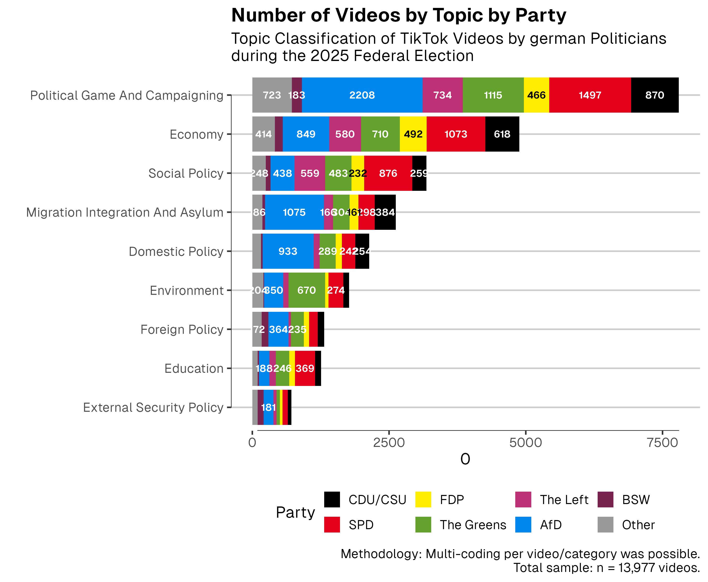
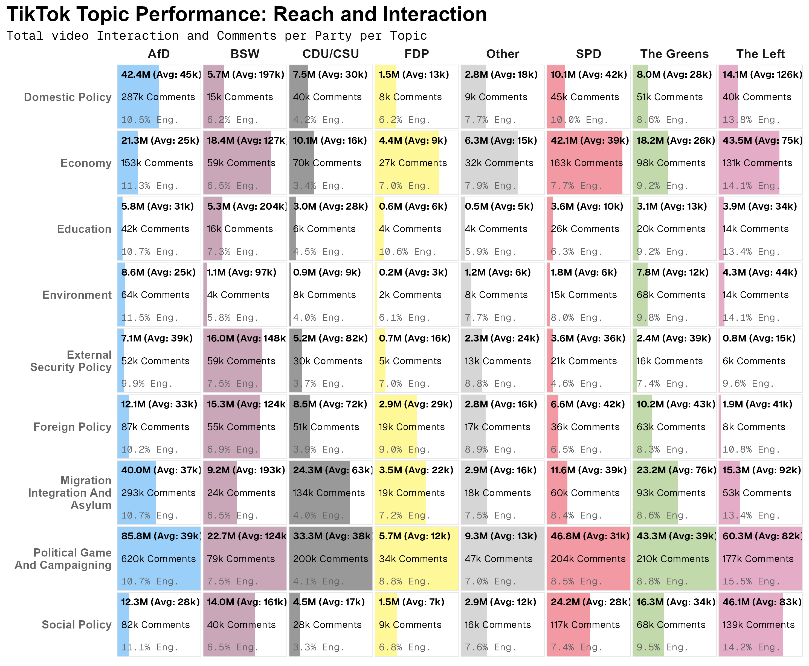
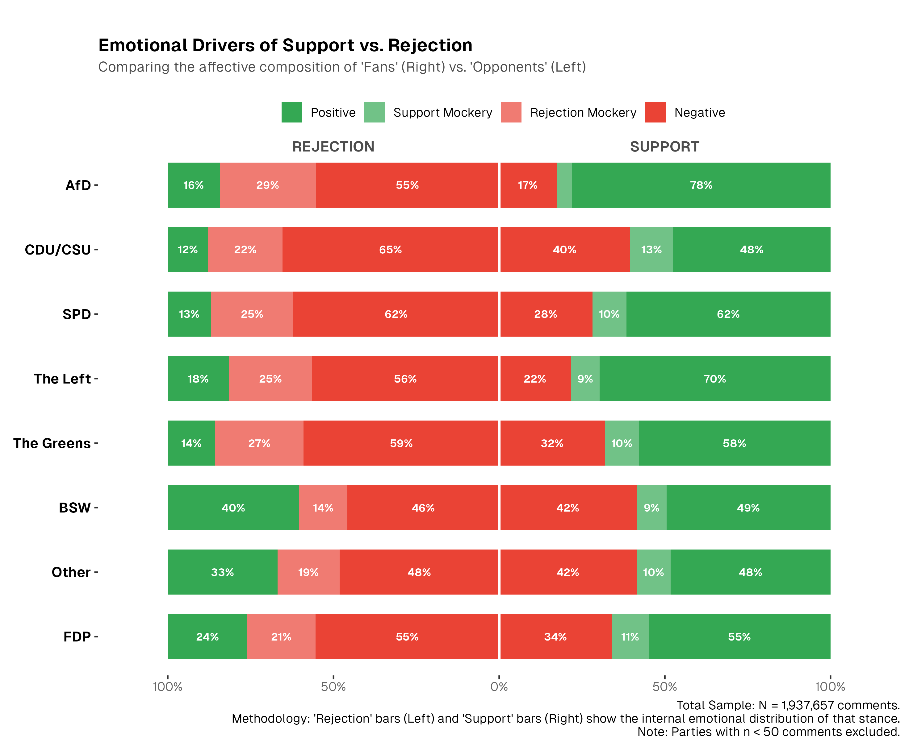
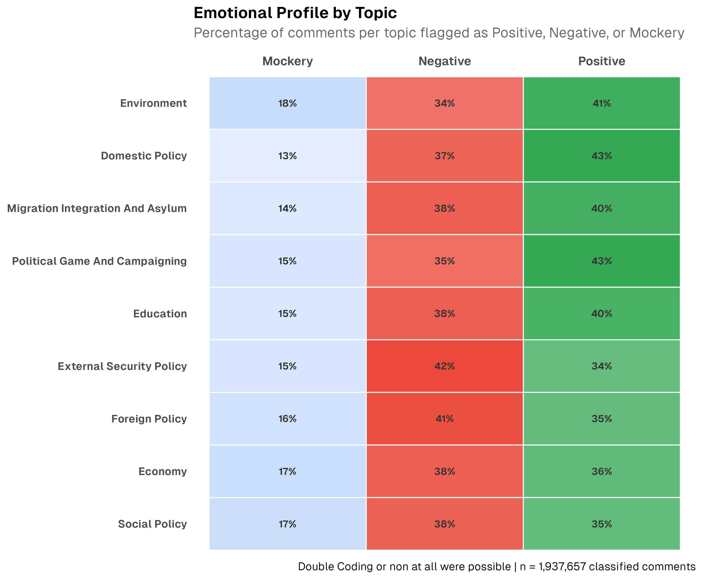
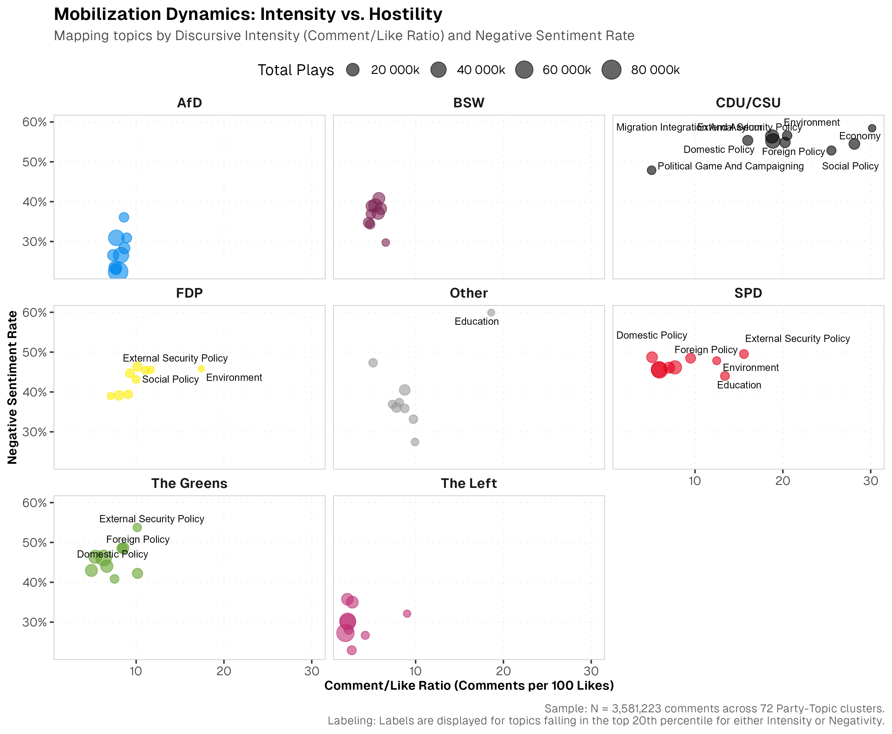
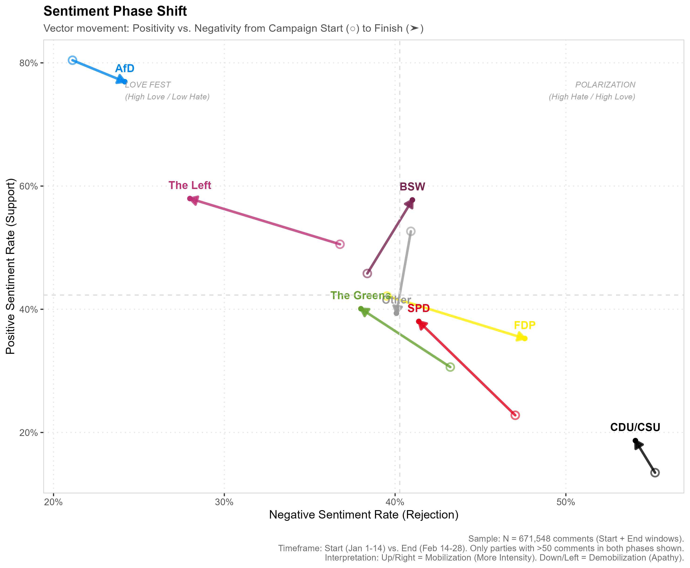

<iframe src="affective-field.html" title="Affective Field Visualization" width="100%" height="600" style="border: none; margin-top: 2rem; margin-bottom: 2rem;">

</iframe>

::::::: columns
::: column
In the analysis of the 2025 German Federal Election, one platform stood out as a primary battleground for affective polarization: **TikTok**. At the recent DGPuK conference in Hamburg, we presented our findings on how political parties utilized this space—not just to broadcast information, but to mobilize "affective counterpublics."

Our research, titled *Love, Loathing, and Loyalty: Affective Counterpublics on German Political TikTok in the Run-up to the 2025 Federal Election*, examined over **20,000 video posts** and nearly **2 million user comments** to understand the emotional landscape of German digital politics. The data reveals a distinct topography of support and rejection online, fundamentally reshaping how we understand digital campaigning.
:::

::::: column
:::: content-card
::: card-body
### Key Takeaways

-   **Dominance of the Fringe:** While the SPD produced the most content, the AfD dominated engagement with 171 million plays.
-   **The Affective Divide:** Parties from the ends of the ideological spectrum (AfD, BSW, Die Linke) generate "love" and loyalty; centrist parties (CDU, SPD, Greens) trigger "loathing" and rejection.
-   **Party over Policy:** User sentiment is driven by the *messenger*, not the *message*. Popular topics do not save unpopular parties.
-   **Methodology:** A hybrid AI analysis of 20,000 videos and 2 million comments using Whisper, GPT-OSS, and SetFit.
:::
::::
:::::
:::::::

## The Methodology: AI-Driven Stance Detection

To manage the sheer volume of discourse generated during the campaign, we employed a hybrid approach combining large-scale data collection with automated content analysis. Our dataset included **1,495 active political accounts** across EU, national, and federal levels, tracking their activity between **January 1 and February 22, 2025**. We utilized advanced AI models to process this information, validating their performance against manually coded subsamples to ensure high reliability.

::::: content-card
:::: card-body
### Technical Deep Dive: Model Performance

::: {style="font-family: var(--font-mono); font-size: 0.9rem;"}
**Transcription:** `Whisper large v2`

**Topic Detection (`GPT-OSS 120b`):** Accuracy: 0.950 \| F1 Score: 0.888

**Stance Detection (`GPT-OSS 120b`):** Accuracy: 0.876 \| Weighted F1: 0.88 \| Krippendorff’s Alpha: 0.766

**Emotion Classification (`SetFit`):** Weighted F1: 0.84 \| Precision: 0.80 \| Recall: 0.88
:::
::::
:::::

This methodological framework allowed us to quantify sentiments that are often treated as purely qualitative with a high degree of confidence.

------------------------------------------------------------------------

## Framing the Inquiry

To investigate these dynamics, we structured our study around three core research questions and two guiding hypotheses derived from the theory of networked publics.

:::::::::::: grid
::::: {.g-col-12 .g-col-md-4}
:::: {.content-card style="height: 100%;"}
::: card-body
### RQ1: Attention Hierarchy

**Question:** Which parties dominate on TikTok?

We aimed to distinguish between mere "noise"—the volume of videos posted—and actual resonance, defined by plays and engagement. Reach does not equal loyalty.
:::
::::
:::::

::::: {.g-col-12 .g-col-md-4}
:::: {.content-card style="height: 100%;"}
::: card-body
### H1: Polarization Advantage

**Hypothesis:** Parties on the end of the ideological spectrum create "counterpublic spaces" of mutual affirmation.

We predicted parties at the ideological ends would receive significantly higher positive affect, while the center would function as a target for frustration.
:::
::::
:::::

::::: {.g-col-12 .g-col-md-4}
:::: {.content-card style="height: 100%;"}
::: card-body
### H2: Thematic Interaction

**Hypothesis:** The Topic drives the Sentiment.

We assumed specific topics (e.g., Migration for AfD) would trigger distinct responses, potentially allowing unpopular parties to gain support by pivoting to popular issues.
:::
::::
:::::
::::::::::::

## Findings

### The Asymmetry of Reach and Loyalty

Answering **RQ1**, a central finding of our study is the disconnect between the volume of content produced and the engagement received. The Social Democratic Party (SPD) maintained the highest number of active accounts (318) and posts (3,489), flooding the platform with content. However, this volume did not translate into dominance over the conversation.

::::: {layout-ncol="2"}

::: {.content-card style="padding: 15px;"}
[{.lightbox group="my-plots" width="100%" style="border-radius: 4px;"}](images/Topics_party_abs.png)

::: {.card-body style="padding-top: 10px;"}

Topic Prevalence

:::
:::

::: {.content-card style="padding: 15px;"}
[{.lightbox group="my-plots" width="100%" style="border-radius: 4px;"}](images/Eng_Topic_Party.png)

::: {.card-body style="padding-top: 10px;"}

Engagement per Party

:::
:::

:::::

In stark contrast, the Alternative for Germany (AfD) dominated in affective engagement. Despite having fewer active accounts than the SPD, the AfD garnered the highest number of plays, reaching **171 million**, and generated over **one million comments**. This disparity highlights a crucial trend where algorithmic success is driven less by the frequency of posting and more by the intensity of the reaction the content provokes.

### Affective Counterpublics: Love vs. Loathing

The nature of this engagement provided robust confirmation for **Hypothesis 1**, revealing a stark divide in how different political camps experience the platform. We observed a phenomenon of intense loyalty at the fringes of the political spectrum, where parties situated at the ideological ends received significantly higher affirmation from their audiences.

::::: {layout-ncol="2"}

::: {.content-card style="padding: 15px;"}
{.lightbox group="my-plots" width="100%" style="border-radius: 4px;"}

::: {.card-body style="padding-top: 10px;"}

Emotional Drivers (Party)

:::
:::

::: {.content-card style="padding: 15px;"}
{.lightbox group="my-plots" width="100%" style="border-radius: 4px;"}

::: {.card-body style="padding-top: 10px;"}

Emotional Drivers (Topic)

:::
:::

:::::

The AfD stands out most prominently, receiving overwhelming support in their comment sections. However, this trend of "fringe loyalty" extends beyond the right; The Left (Die Linke) and the Bündnis Sahra Wagenknecht (BSW) also operated in net-positive environments. This data supports the existence of *affective counterpublics*—digital spaces where marginalized or oppositional groups mobilize not just through shared ideas, but through shared emotion. For these groups, TikTok functions as a safe harbor where identity is reinforced through mutual affirmation, effectively creating a self-reinforcing bubble of "love."

::::::::: grid
::::: {.g-col-12 .g-col-md-6}
:::: content-card
::: card-body
### The Sphere of Love (Loyalty)

Fringe parties enjoy "safe harbors" of high support.

-   **82%** Support for **AfD**
-   **61%** Support for **Die Linke**
-   **56%** Support for **BSW**
:::
::::
:::::

::::: {.g-col-12 .g-col-md-6}
:::: {.content-card style="background-color: var(--color-1); color: var(--color-2); border: 2px solid var(--color-2);"}
::: card-body
### The Sphere of Loathing (Rejection)

Centrist parties act as lightning rods for frustration.

-   **74%** Rejection for **CDU/CSU**
-   **\>50%** Rejection for **SPD & Greens**
-   **\~50%** Split for **FDP**
:::
::::
:::::
:::::::::

Conversely, the political center faced a much harsher reality, serving as a projection surface for the platform's collective frustration. The CDU/CSU acted as a lightning rod for antagonism, with a staggering **74% of comments classified as rejection**—the highest disapproval rate of any party. The governing parties fared little better; the SPD and Greens also saw rejection rates climb above 50%, while the FDP hovered near an even split. In these spaces, constructive debate is largely drowned out by constant "loathing," often characterized by mockery and negative sentiment. This structural imbalance suggests that for centrist parties, TikTok is less a tool for mobilization and more a hostile environment where they must constantly defend against a wall of negative affect.

### It’s Not About the Topic, It’s About the Party

We also investigated **RQ3** and tested **Hypothesis 2** to see if specific topics, such as migration or the economy, could alter these emotional responses. Traditional political strategy suggests that parties gain traction when they speak on issues they "own"—for example, the CDU on economic competence or the Greens on climate protection.

To test this, we classified videos into distinct policy categories like "Political Game," "Economy," "Social Policy," and "Migration." While parties did emphasize their core topics—such as the Greens focusing heavily on the Environment or the AfD on Migration—our interaction models revealed that **H2 was largely disproven in its optimistic interpretation**.

::::: {layout-ncol="2"}

::: {.content-card style="padding: 15px;"}
{.lightbox group="my-plots" width="100%" style="border-radius: 4px;"}

::: {.card-body style="padding-top: 10px;"}

Party Mobilization Dynamics

:::
:::

::: {.content-card style="padding: 15px;"}
{.lightbox group="my-plots" width="100%" style="border-radius: 4px;"}

::: {.card-body style="padding-top: 10px;"}

Sentiment Shift

:::
:::

:::::

We found that affect is party-driven, not topic-driven. The data revealed that user reactions remained consistent with the party identity, regardless of the content being discussed. For instance, the AfD maintained extremely high support levels even when discussing topics outside their core brand, such as Education or Environmental policy. Conversely, the CDU/CSU faced high rejection rates even when discussing the Economy, a topic where they traditionally enjoy high voter trust. The "topic" column in our data changed, but the "sentiment" row remained static.

This suggests we are witnessing a form of *party-centered affective polarization*, where the messenger matters far more than the message itself. In this environment, refining the content strategy or pivoting to popular issues offers limited returns, because the visceral reaction—whether love or loathing—is triggered by the party brand before the video even finishes playing.

## Conclusion

The data from the 2025 election campaign on TikTok signals a profound digital reconfiguration of the public sphere, shifting from a space of deliberation to one of affective fragmentation. We observed the solidification of distinct **"connective factions,"** where political identity is forged through shared emotional experiences rather than policy debates.

In this landscape, extreme and oppositional parties have demonstrated a superior capability to mobilize loyalty and "love," creating self-sustaining bubbles of affirmation that insulate their followers from outside critique. Meanwhile, centrist parties, lacking this emotional glue, struggled to penetrate these barriers and instead found themselves uniting disparate groups only in their shared rejection of the status quo.

For political communicators and researchers, these findings offer a stark warning: **TikTok is not simply a repository for viral clips or youth outreach, but a sophisticated arena for the articulation of deep-seated affective political identities.** To compete, actors must recognize that in the economy of attention, emotional resonance—whether love or loathing—is the currency that matters most, leaving the rational middle at a distinct disadvantage.

------------------------------------------------------------------------

**Contact:** *Julia Niemann-Lenz* \| [lenz\@dzhw.eu](mailto:lenz@dzhw.eu)\
*Hamburg, Germany*
